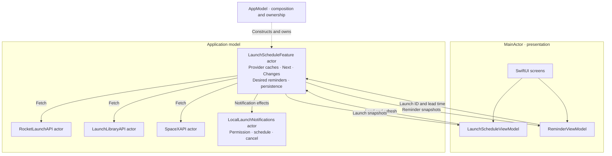

# RocketLaunch architecture

**AppModel owns one business actor, LaunchScheduleFeature, which owns both launch schedules and reminder decisions. Two MainActor ViewModels present different snapshots of that same actor.**

Both ViewModels use LaunchScheduleFeatureAPI. The two snapshot streams serve presentation needs; they do not imply two state owners. Source cache updates and corresponding desired reminder changes happen synchronously inside the same actor, with no cross-feature reconciliation message.

Group state that must change consistently under one actor. A screen, tab or product feature name does not automatically require another actor.

## Ownership and commands

LaunchScheduleFeatureAPI is declared above its actor implementation. It exposes launch snapshots, reminder snapshots, load/refresh commands, setReminder(for:minutesBefore:) and removeReminder(_:). AppModel constructs and retains this one feature with injected repositories, notification client, clock and reminder storage. It performs no network or persistence work during initialization.

The feature owns provider caches, source phases/cooldowns, operator groups, upcoming ordering, stored Next, the change journal and desired reminder records. MainActor observable ViewModels own UI snapshots, formatting, filtering and user interaction. API actors own transport/decoding. LocalLaunchNotifications owns iOS notification calls and shared permission handling. Actors have serial isolation domains, not dedicated CPU cores.

## Reminder transaction and external effect

The UI sends a source-qualified launch ID and 5, 15 or 60 minutes of lead time. The feature resolves its current cache, validates timing/capacity and persists a pending desired reminder without suspension. Unknown IDs are rejected. No stale RocketLaunch value returns from a screen to drive a save.

Successful source commits synchronously update desired reminders before any notification await. Timing changes prepare a new notification identity; invalid timing flags the record and cancels the old alert. External scheduling happens afterward. An effect confirms delivery only if its notification identity is still current. Obsolete success cleans up its own alert; obsolete failure cannot mark a newer record failed. Removal deletes desired state before canceling externally.

ReminderSaveOutcome.saved confirms that iOS accepted scheduling of that revision; it does not confirm alert delivery. Superseded means a newer desired state or removal replaced it; it does not mean the initial desired state was never stored. The UI explains this and shows pending, scheduled and failed delivery honestly. Failed desired records are retained for retry/removal and count toward capacity. Existing storage is backward compatible; an interrupted pending record is flagged on reload. Permission requests originate from user saves, including replacements while that intent is still active; background refresh alone does not prompt.

## Request lifetime and cooldown

Refresh-all uses structured child callers. Each provider keeps one explicitly owned request Task with a unique ID and cancellation-aware waiters. Active calls join before cooldown is considered. Canceling one waiter preserves other callers' work. Canceling the last immediately detaches ownership, restores settled source state and cancels transport. Late detached responses are rejected by ID, even if the transport takes longer to stop. Committed data remains settled while notification effects finish.

loadIfNeeded joins loading sources and requests idle ones. Successful caches and failed-source retry decisions are preserved. ViewModels ignore overlapping refresh taps rather than canceling useful requests. Root disappearance cancels caller and observer tasks; tab changes retain the shared root owners. Notification effects use desired-state identity rather than assuming cancellation rolls back system side effects.

## Snapshot delivery

Launch and reminder streams are separate immutable projections of one actor. Each subscriber gets initial replay and its own bufferingNewest(1) stream. Registration and initial replay are actor-isolated. Revisions and subscription generations protect MainActor publication. An unchanged launch snapshot is not republished; meaningful time changes, including cooldown expiry, are published. Clock processing does not rebuild operator groups.

## Verification

98 host XCTest cases pass against real Model/ViewModel sources. The iOS app and test bundle build with Swift 6 complete concurrency checking. All 98 tests also passed in Xcode on the iPhone Air simulator (iOS 26.2) on 7 September 2026. Earlier live checks loaded RocketLaunch.Live and Launch Library with independent SpaceX failure. Test clients validate notification identities and cleanup, not physical-device alert delivery. Instruments responsiveness measurements remain separate validation work.

### Refresh completion and notification delivery

A provider refresh completes after committing launch data and desired reminder state. It removes its active request and resumes callers without awaiting notification delivery. The feature owns separate task batches for those effects; each batch uses a task group and removes its handle when finished. These tasks retain the model until delivery and obsolete-notification cleanup settle. Screen cancellation does not cancel committed reminder intent. New downloads still respect provider cooldowns and share genuinely active downloads.

Reminder snapshots report pending, scheduled or failed delivery independently of refresh completion. Direct user saves still await their own delivery result.

Teaching sequence: [Three-day teaching guide](TEACHING_GUIDE.md). Validation evidence and device exercises: [Teaching validation](TEACHING_VALIDATION.md).
