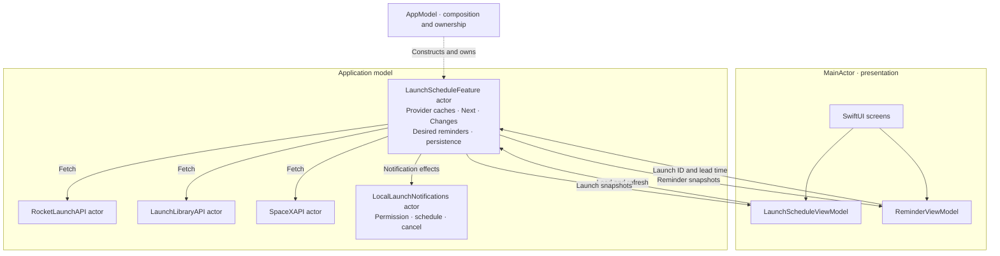

# Swift Concurrency with Feature Actors

**Modern iOS Architecture 26**  
A practical architecture for AppModel, feature actors and observable ViewModels.  
2026 edition · Developed through the RocketLaunch teaching application · 7 September 2026

> Keep the main actor focused on presentation. Give business features ownership of their state and processing. Connect them through asynchronous commands and immutable snapshots.

“Modern iOS Architecture 26” is the name of this reference edition. It describes our current architectural choices, not an Apple standard or a requirement to replace working architecture every year. The principles should remain useful as Swift and its frameworks evolve.

## 1. Three ideas that fit together

AppModel, KISS and feature actors answer different questions.

| Idea | Question it answers | Practical result |
| --- | --- | --- |
| **AppModel** | What constitutes the runnable application model, and who owns it? | An explicit composition root constructs features and connects their dependencies. |
| **Feature actors** | Where does business state live, and where does its processing execute? | Related business state has an isolated owner outside the main actor. |
| **KISS** | How much structure does this application actually need? | Clear responsibilities with a small number of useful types and boundaries. |
| **Observable ViewModels** | What state does this interface need to present? | Main-actor presentation state that the UI can read synchronously. |

Together, these ideas make the architectural separation between the interface and the model an execution boundary as well as an organizational boundary.

We do not need to invent a framework to express this. Swift already supplies actors, Sendable values, asynchronous functions, task groups, asynchronous sequences and Observation.

## 2. The model is the runnable application

In this architecture, “model” means more than the structs decoded from JSON. It includes the application's rules, feature state, calculations, coordination and storage behavior. Those data structs are values used by the model.

RocketLaunch's model can retrieve launch data, maintain provider caches, group operators, choose the next launch, detect schedule changes and manage reminders without a SwiftUI screen telling it how to perform those operations. Tests invoke those capabilities directly through injected dependencies.

The interface expresses user intent and presents results. It does not decide which provider response is authoritative or whether an outdated launch qualifies as Next.

This is a deliberate interpretation of model separation. It is compatible with familiar separation-of-concerns principles, without claiming that every MVVM implementation or every piece of architecture literature prescribes this exact design.

## 3. The architecture at a glance

**AppModel owns one business actor, LaunchScheduleFeature, which owns both launch schedules and reminder decisions. Two MainActor ViewModels present different snapshots of that same actor.**



Both ViewModels use LaunchScheduleFeatureAPI. The two snapshot streams serve presentation needs; they do not imply two state owners. Source cache updates and corresponding desired reminder changes happen synchronously inside the same actor, with no cross-feature reconciliation message.

Group state that must change consistently under one actor. A screen, tab or product feature name does not automatically require another actor.

## 4. Making effective use of Swift Concurrency

The goal is to leave execution resources available for useful work and keep expensive business processing away from UI execution. It is not to maximize the number of threads or force every CPU core to remain busy.

An asynchronous network operation can suspend while it waits for a response. A suspended task does not require a thread to sit waiting. Structured child tasks let independent operations overlap, while their parent retains responsibility for completion and cancellation. These are central parts of Swift's concurrency model. [Structured concurrency: SE-0304](https://github.com/swiftlang/swift-evolution/blob/main/proposals/0304-structured-concurrency.md)

An ordinary feature actor provides a separate isolation domain. Its actor-isolated synchronous work runs through its executor, rather than being placed on the main actor. An actor serializes access to its state; it does not reserve a thread or a CPU core. Separate actors can make concurrent progress, and their work may execute in parallel when scheduling and hardware permit. [Actors: SE-0306](https://github.com/swiftlang/swift-evolution/blob/main/proposals/0306-actors.md)

For RocketLaunch, this means launch calculations can proceed independently of rendering and interaction. It does **not** mean that one sorting operation automatically occupies five other CPU cores. If a future feature contains a large, divisible calculation, parallelizing that calculation is a separate, measured design decision.

### The boundary is actor isolation, not the word `async`

A main-actor ViewModel can call:

```swift
await feature.refresh()
```

When `feature` is our concrete feature actor, its actor-isolated method executes under that feature's isolation. The calling task can suspend and the main actor can process other work. When the ViewModel resumes its own isolated code, it resumes on the main actor.

Writing `async` on a MainActor method does not relocate its synchronous calculations. Likewise, `Task {}` created in a main-actor context generally inherits that actor context. Our separate concrete actors establish the intended execution boundary.

Swift 6.2 also introduced `@concurrent` for explicitly running a nonisolated asynchronous function away from the caller's actor. It can be useful for independent computations. This architecture does not depend on that annotation: its stateful business boundary is expressed with actors. Compiler settings affect the defaults for nonisolated async functions, so a team should document those settings rather than infer execution from `async` alone. [Async function isolation: SE-0461](https://github.com/swiftlang/swift-evolution/blob/main/proposals/0461-async-function-isolation.md)

## 5. The team rule for the main actor

**The main actor owns presentation and UI interaction. Substantial business processing belongs to feature actors or appropriate services.**

| Main-actor responsibilities | Feature/service responsibilities |
| --- | --- |
| Observable presentation state | Authoritative business state |
| Navigation and transient interaction state | Eligibility and selection rules |
| Display formatting and small user filters | Grouping, substantial sorting and transformations |
| Theme selection | Data retrieval, decoding and persistence |
| Starting and managing UI-owned tasks | Coordinating business operations and publishing outcomes |

This is a responsibility rule, not a ban on every calculation on the main actor. Formatting a short label or applying a small screen filter may be entirely appropriate. If presentation work becomes expensive, measure it and move the expensive portion behind a suitable asynchronous boundary.

Likewise, placing blocking file or legacy API calls in an actor does not make those calls cooperative. They still occupy their executor's worker while running. Large synchronous I/O needs an appropriate implementation; simply wrapping it in an actor is not a universal solution.

## 6. AppModel constructs the graph

AppModel provides a recognizable entry point to the runnable model. In RocketLaunch it constructs one launch-and-reminder feature actor with API and notification dependencies. There is no second reminder actor or reconciliation callback.

Its composition method is main-actor isolated because that is convenient for the app entry point. This does not transfer main-actor isolation to separately constructed feature actors.

Construction should remain lightweight. It should not quietly start network requests or perform substantial storage work. RocketLaunch loads saved reminders lazily within the shared feature actor when a command or subscription first needs them.

The shared live graph is a production convenience. Tests can construct independent graphs with controlled repositories, notification clients and isolated storage. Feature implementations should receive dependencies rather than reach back into `AppModel.shared` for collaborators.

## 7. A feature owns its state and its API

Our naming convention is explicit:

```swift
protocol LaunchScheduleFeatureAPI: AnyObject, Sendable {
    var snapshot: LaunchScheduleSnapshot { get async }
    func snapshots() async -> AsyncStream<LaunchScheduleSnapshot>
    func refresh() async
    func refresh(source: LaunchSourceID) async
    func updateNextLaunch() async
}

actor LaunchScheduleFeature: LaunchScheduleFeatureAPI {
    // Authoritative state, commands and snapshot publication.
}
```

This is an abbreviated declaration from the application. The protocol sits immediately above its concrete implementation in the same file. The stored dependency can simply be named `launchSchedule`.

The protocol describes the asynchronous contract and requires a Sendable implementation. The concrete `actor` declaration establishes this implementation's isolation. A protocol alone does not guarantee that every possible conformer uses a non-main executor.

Choose feature boundaries around meaningful business ownership. Launch scheduling and reminders have separate state and responsibilities, so separate actors are useful. A trivial display preference does not need an actor, snapshot stream and service abstraction just to satisfy a diagram.

## 8. Snapshots connect isolated state to observable state

SwiftUI needs values it can read synchronously while evaluating a View. It should not await actor properties from `body` or reconstruct business decisions during rendering.

Each feature therefore publishes a complete immutable Sendable snapshot. The feature remains authoritative; the ViewModel holds a local representation for presentation. The UI sends commands to change the model, rather than mutating that representation and treating it as business truth.

Our main-actor ViewModels use `@Observable`. When a View reads observable properties, Observation can track those dependencies and SwiftUI can update the relevant presentation when they change. This gives the interface a coherent local state to read; it does not promise that SwiftUI performs a cheap equality comparison of the whole model or skips all rendering work. [Observation: SE-0395](https://github.com/swiftlang/swift-evolution/blob/main/proposals/0395-observability.md)

The same separation can support UIKit. A main-actor controller can observe or consume presentation updates and apply them to its views. UIKit does not gain SwiftUI's rendering behavior merely because the ViewModel is observable.

There is a granularity tradeoff: storing one aggregate snapshot makes coherent publication simple, but changing that property may invalidate multiple consumers. Split presentation state further only when measurements or screen requirements justify it.

## 9. Why the state travels through a stream

A single return value is sufficient for a single result. RocketLaunch needs progressive results: one provider may finish while another is still loading or failing.

Its feature API exposes both a current snapshot and a stream of snapshots. The production stream contract is:

- Each subscriber receives its own stream and continuation.
- Registration and initial-state replay happen in one actor-isolated operation.
- Publications contain complete state, not partial mutations that consumers must reconstruct.
- `bufferingNewest(1)` keeps the latest complete snapshot for a slow consumer.
- Each publication carries a monotonically increasing revision.
- Ending one subscription does not terminate the other subscribers.

Newest-value buffering is suitable for current screen state. It would be inappropriate for a stream of payments, analytics events or commands where every item must be processed. RocketLaunch's change journal is part of authoritative feature state, so a later snapshot still contains retained changes even if an intermediate snapshot was skipped.

LaunchScheduleFeature suppresses publications when the complete snapshot is unchanged. Clock processing still publishes meaningful changes, including cooldown expiry and changed upcoming eligibility. The actor also owns loadIfNeeded, avoiding a duplicate initial fetch when a newly created ViewModel has not received its first snapshot.

ViewModels reject older revisions. This protects against a delayed stream value arriving after a newer direct snapshot read. Subscription generation IDs also prevent a canceled consumer from publishing into a restarted observation session.

## 10. Structured callers and shared provider requests

Refresh-all uses a task group to call each provider independently. Every provider call registers a cancellation-aware waiter with the feature. If that source already has an active request, the new caller joins it instead of starting another HTTP request. Joining does not bypass cooldown because no additional request is made.

The feature explicitly owns one Task per active provider request. Each task calls the API actor and submits its result with a request ID. Callers remain responsible for their own wait lifetime. Canceling one waiter leaves work running for other waiters; canceling the last detaches that request, restores its settled state and cancels transport. A late result cannot commit because its request ID no longer matches. A new caller can begin even if old transport has not yet cooperated with cancellation.

ViewModels retain their UI task handles and ignore repeated refresh taps while the same command is active. Root disappearance cancels those callers and their snapshot subscriptions. loadIfNeeded joins loading sources and requests idle sources, preserving completed caches. Tab changes retain the root owners. Snapshot tasks capture ViewModels weakly between values.

Not every task is structurally nested: shared provider requests, UI event tasks, observation consumers and the notification client's shared permission request have explicit owners. Short stream-termination tasks remove their continuation on the actor. No detached tasks or blocking waits are used.

## 11. Make the model decision before suspension

The reminder command carries user intent:

```swift
try await feature.setReminder(for: launchID, minutesBefore: 15)
```

On LaunchScheduleFeature, the command looks up the current cached launch, validates its time and lead time, checks capacity and stores a desired reminder marked pending. There is no await between these decisions. An old detail screen therefore cannot overwrite the current launch time: it supplies identity and a preference, not launch data.

An accepted source refresh updates the cache and desired reminders in the same uninterrupted actor operation. Pending first saves are already model records, so they participate naturally. The model then publishes snapshots and applies notification effects asynchronously. Unknown or elapsed times produce an honest failed reminder and cancellation of its previous alert. Missing IDs are rejected; the UI must refresh current launch data rather than use an old screen value as a substitute.

Every desired reminder has a unique notification ID, which also identifies its revision. After iOS scheduling returns, the actor checks that this ID still belongs to the desired record. If it does, delivery becomes scheduled. Otherwise it cancels that obsolete notification and returns superseded. The same identity check prevents a delayed error from damaging a newer reminder. Removal deletes desired state before awaiting external cancellation.

The notification client coalesces overlapping user-authorized permission requests. A refresh replacing a still-active user save may continue that permission intent; an ordinary refresh does not initiate a new permission prompt. Scheduling errors remain visible as failed delivery. The desired reminder remains available for retry or removal; failed and pending records count toward the 50-record limit. Persisted pending records are shown as interrupted after restart, not presumed delivered. Older records without a delivery-status field remain readable.

Actor isolation does not make iOS notification operations transactional. The system side effect still requires reconciliation, and an alert already delivered cannot be recalled. The architecture makes the business decision synchronous and narrows the remaining ordering work to this explicit external boundary.

## 12. KISS keeps the architecture teachable

The purpose of these boundaries is to make ownership and execution easier to understand. Keep that benefit visible in the code:

1. Keep a feature's protocol and implementation together.
2. Put state that must change consistently under the same actor; do not create an actor for each tab.
3. Use ordinary Sendable values for results and dependencies.
4. Keep decoding details private to the API adapter where practical.
5. Add streams when progressive or ongoing state warrants them.
6. Keep substantial business rules out of presentation getters.
7. Avoid universal managers, generic event buses and detached tasks introduced merely to “make it concurrent.”

A model can remain feature-isolated without every helper becoming another actor. Synchronous helpers called from the owning actor can execute within that actor's current execution context. Expensive independent work can be separated when there is a concrete reason.

## 13. Applying this to an existing app

Start by identifying the authoritative state and its owner. Then classify work by responsibility and execution requirements.

For a feature that should become an actor, replace synchronous UI reads of mutable feature state with a Sendable snapshot contract. Move UI observability to the main-actor ViewModel. Add asynchronous commands and, where needed, a stream with initial replay and a defined buffering policy.

Audit every new suspension point for stale data, cancellation and reentrancy. Move substantial persistence out of composition initializers. Preserve behavior such as progressive loading and independent failures rather than returning one final result just because it simplifies a function signature.

Finally, test the boundary itself as well as the feature's answers. The compiler checks isolation and Sendable requirements; tests check behavior, ownership and ordering. Profiling checks the performance outcome.

## 14. What RocketLaunch demonstrates today

The implemented application has:

- One LaunchScheduleFeature actor for caches, grouping, chronological ordering, eligibility, Changes, Next, desired reminders and persistence.
- API actors for asynchronous retrieval, decoding and domain mapping.
- Main-actor observable ViewModels with versioned snapshot delivery.
- Concurrent provider retrieval with independent publication and failure handling.
- Main-actor UI preferences, formatting and small presentation filters.

The shared-actor revision has **98 passing macOS host tests**. The iOS application and test bundle build successfully with Swift 6 and complete concurrency checking. Tests cover ID-based saves, stale detail values, desired state before suspension, late notification cleanup, unknown times, capacity, persistence compatibility, shared requests, cancellation recovery, actor boundaries and progressive UI publication. Earlier two-feature tests were replaced where their contracts no longer exist; tests now exercise the unified public API.

The Mac was locked during this pass, so the updated suite has not been executed in the iPhone simulator. Previous simulator and live-provider checks belong to the preceding revision, not this refactor. Physical-device notification delivery and Instruments profiling remain open.
This establishes that the intended boundaries work in the tested implementation. It is not an Instruments benchmark, a guarantee of zero UI stalls, or evidence that every hardware core is being used. Device responsiveness, large datasets, expensive formatting and notification delivery remain matters for targeted validation.

## 15. The architectural conclusion

We are making proper use of Swift's runtime by giving it explicit isolation, suspendable work and meaningful opportunities for concurrency. The runtime manages threads; the architecture determines what work competes with the UI and how results become safe to present.

**AppModel gives the application an identifiable model. Feature actors give that model execution boundaries. Observable ViewModels give the interface local presentation state. KISS keeps those choices understandable.**

That is the intent of **Modern iOS Architecture 26: Swift Concurrency with Feature Actors**.

## Further reading in this repository

- [Current RocketLaunch architecture](ARCHITECTURE.md)
- [Concurrency ownership and guarantees](CONCURRENCY_INVENTORY.md)
- [Provider behavior and limitations](MULTI_PROVIDER_DESIGN.md)
- [Migration decisions and verification](MIGRATION_LEDGER.md)
- [Migration cleanup lessons](MIGRATION_CLEANUP_NOTES.md)

### Refresh completion and notification delivery

A provider refresh completes after committing launch data and desired reminder state. It removes its active request and resumes callers without awaiting notification delivery. The feature owns separate task batches for those effects; each batch uses a task group and removes its handle when finished. These tasks retain the model until delivery and obsolete-notification cleanup settle. Screen cancellation does not cancel committed reminder intent. New downloads still respect provider cooldowns and share genuinely active downloads.

Reminder snapshots report pending, scheduled or failed delivery independently of refresh completion. Direct user saves still await their own delivery result.
